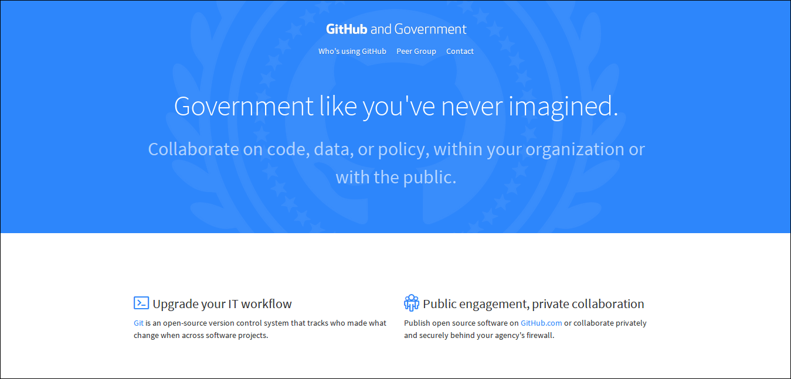

# GitHub and Government [](https://travis-ci.org/github/government.github.com)



Gather, curate, and feature stories of people using GitHub as part of their open government innovations.

The site is open source (here's all the code!) and is a tool _for_ and _by_ the community.

Submit [issues](https://github.com/github/government.github.com/issues/new) and [pull requests](https://github.com/github/government.github.com/compare/) for stories, site ideas or copy edits.

### Goals

- Share stories of real world experiences using GitHub in open Government
- Demystify open source terminology
- Showcase the community using GitHub to promote connections and sharing between individuals and organizations.
- Make getting started with GitHub easier

### Under the Hood

This site is made with [Jekyll](http://jekyllrb.com), an open source static site generator. This means the Jekyll program takes the content we want to be on the site and turns them into HTML files ready to be hosted somewhere. Awesomely, GitHub provides free web hosting for repositories, called [GitHub Pages](http://pages.github.com/), and that's how this site is hosted. The content for the site is on a branch named [gh-pages](https://github.com/github/government.github.com/tree/gh-pages).

## Contributing

#### Fix/Edit Content

If you see an error or a place where content should be updated or improved, just fork this repository to your account, make the change you'd like and then submit a pull request. If you're not able to make the change, file an [issue](https://github.com/github/government.github.com/issues/new).

#### Add Organization

If you know of an organization that should be added to the organization list that generates the matrix of avatars on the [Community](https://government.github.com/community/) page: fork this repository, open the `_data/organizations.yml` file and add it to the appropriate section of the list in the format being used. Commit your change and submit a pull request to us!

---

## To Set up Locally

You can take all the files of this site and run them just on your computer as if it were live online, only it's just on your machine.

#### Requirements

* [Jekyll](http://jekyllrb.com/)
* [Ruby](https://www.ruby-lang.org/en/)
* [Git](http://git-scm.com/)

_If you have installed [GitHub Desktop](https://desktop.github.com), Git was also installed automatically._

To copy the repository's files from here onto your computer and to view and serve those files locally, at your computer's command line type:

```bash
git clone https://github.com/github/government.github.com.git
cd government.github.com
script/bootstrap
script/server
```
Open `http://localhost:4000` in your browser

----

Don't see what you're looking for? Create an [issue](https://github.com/github/government.github.com/issues/new), we'll do our best to help you out.
