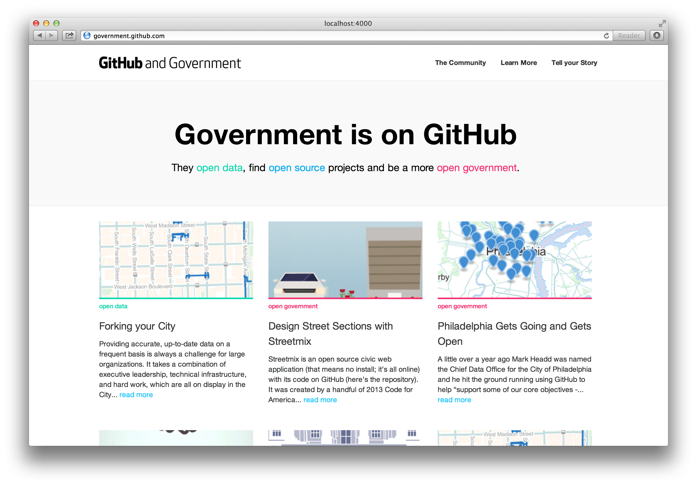

# GitHub and Government

## About the Site

GitHub helps developers around the world work better together. The same tools that enable developers are also enabling governments to work better together, too. 

This gets us really excited.

That's why we've built [government.github.com](http://government.github.com), a site dedicated to all things open government and GitHub. We believe highlighting the community, working together, and sharing processes helps everyone. 

On the site you'll find stories of how government organizations have used GitHub for awesome things like opening data (and hurdles they overcame, too) or finding open source civic apps to use, and for what is at GitHub's core: collaboration.

This repository is all of the code that makes [government.github.com](http://government.github.com); it's open source! If you see something that can be improved or you have a story to share, submit a pull request! 

If you have any more questions, feel free to reach out to the government team at [government@github.com](mailto:government@github.com).

### About the Site, Technically

This site is made with [Jekyll](http://jekyllrb.com), an open source static site generator. This means the Jekyll program takes the content we want to be on the site and turns them into HTML files ready to be hosted somewhere. Awesomely, GitHub provides free web hosting for repositories, called [GitHub Pages](http://pages.github.com/), and that's how this site is hosted. The content for the site is on a branch named [gh-pages](https://github.com/github/government.github.com/tree/gh-pages).  

## To Contribute

We hope you'll join in making this resource!

### Fix/Edit Content

If you see an error or a place where content should be updated, just fork this repsository to your account, make the change you'd like and then submit a pull request.

### Add a Story

Instructions for contributing a story are in [docs/submit.md](https://github.com/github/government.github.com/blob/master/docs/submit.md).

### Add Organization

If you know of an organization that should be added to the organization list that generates the matrix of avatars on the [Community] page: fork this repository, open the `_config.yml` file and add it to the appropate section of the list in the format being used. Commit your change and submit a pull request to us!

---

## To Set up Locally

You can take all the files of this site and run them just on your computer as if it were live online, only it's just on your machine. 

### Requirements

* [Jekyll](http://jekyllrb.com/), [Ruby](https://www.ruby-lang.org/en/)
* [Git](http://git-scm.com/)
 * _If you use [GitHub for Windows](http://windows.github.com) or [GitHub for Mac](http://mac.github.com), Git will install automatically._

At your computer's command line type: 

1. `git clone https://github.com/github/government.github.com.git`
 - This copies all of the repository's files onto your computer.
2. `cd government.github.com`
 - This navigates you inside of the repository's folder on your computer.
3. `script/bootstrap`
 - Intalls styles
4. `script/server`
 - Launches a local server for hosting the site
5. `open http://localhost:4000`
 - Opens the site at the server address, in your browser

## Jekyll Auth

For information on authentication, see the [Jekll-auth readme](https://github.com/benbalter/jekyll-auth)

----

Anything else? Submit an [Issue](https://github.com/github/government.github.com/issues/new) or email [government@github.com](mailto:government.github.com).
